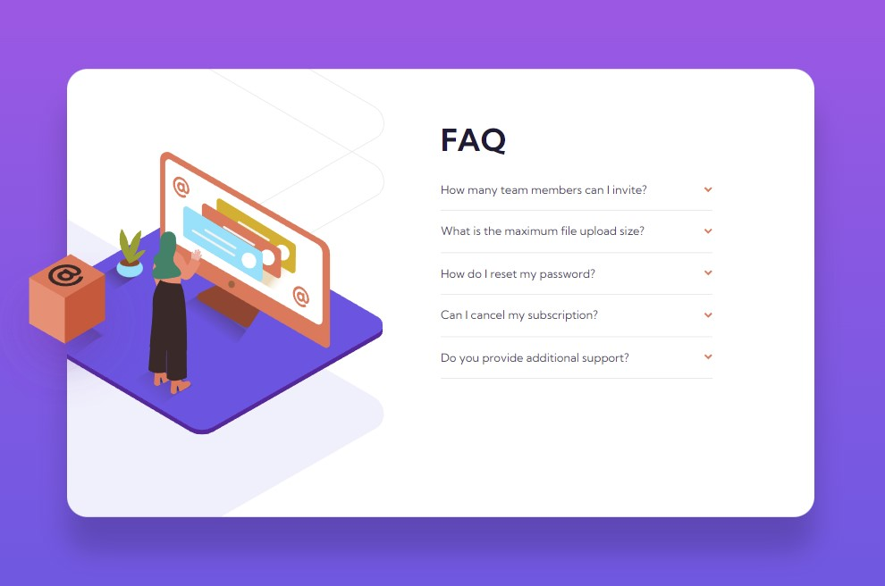

# Frontend Mentor - FAQ accordion card solution

This is a solution to the [FAQ accordion card challenge on Frontend Mentor](https://www.frontendmentor.io/challenges/faq-accordion-card-XlyjD0Oam). Frontend Mentor challenges help you improve your coding skills by building realistic projects. 

## Table of contents

- [Overview](#overview)
  - [The challenge](#the-challenge)
  - [Screenshot](#screenshot)
  - [Links](#links)
- [My process](#my-process)
  - [Built with](#built-with)
  - [What I learned](#what-i-learned)

## Overview

### The challenge

Users should be able to:

- View the optimal layout for the component depending on their device's screen size
- See hover states for all interactive elements on the page
- Hide/Show the answer to a question when the question is clicked

### Screenshot

### Links

- Solution URL: <https://www.frontendmentor.io/solutions/responsive-faq-section-using-vuejs-and-tailwind-css-QMwEICI3Rw>
- Live Site URL: <https://fm05-faq-accordion-card.netlify.app/>

## My process

### Built with

- [Vue.js](https://vuejs.org/)
- [Tailwind CSS](https://tailwindcss.com/)
- Flexbox
- CSS Grid
- Mobile-first workflow

### What I learned

This was both the second project I did with Vue.js and Tailwind CSS so i learned some more about those. I struggled a little bit with getting the images positioned correctly so I guess you could say I learned a little about that too.
